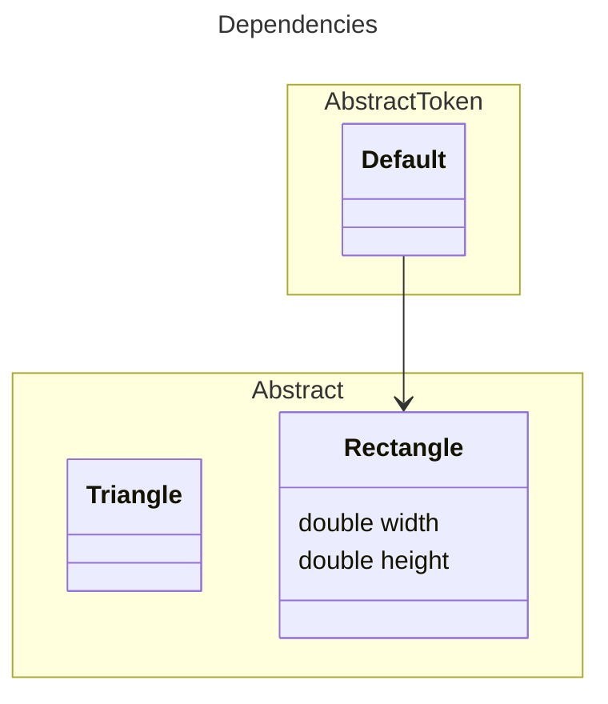

# abstract-class

ECMAScript abstract class generator.

```mermaid
---
title: Dependencies
---

classDiagram

namespace AbstractToken {
	class Default

}

namespace Abstract {
	class Triangle
	class Rectangle {
		double width
		double height
	}
}

Default --> Rectangle
```
