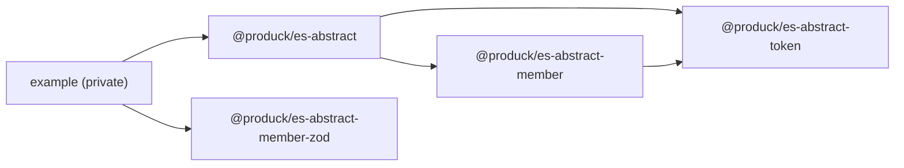

# abstract-class

ECMAScript abstract class generator, maintained as a monorepo.

## Packages

- `@produck/es-abstract-token` — defines abstract constructors and the field
  groups describing the members a subclass has to implement.
- `@produck/es-abstract-member` — ready-made parsers for declaring those
  members.
- `@produck/es-abstract-member-zod` — member parsers built from zod schemas.
- `@produck/es-abstract` — convenience entry re-exporting the toolkit.

Every package documents its own API in `packages/<name>/README.md`.

## Dependency Graph



`@produck/es-abstract-member-zod` only needs `@produck/type-error` plus a peer
`zod`, so it can be used on its own.

## Requirements

- Node.js (current LTS)
- npm

## Getting Started

```bash
npm run produck:install
npm test
```

## Scripts

- `npm run produck:install` — install the workspace dependencies.
- `npm test` — run every workspace test suite.
- `npm run produck:coverage` — run the test suites under `c8` and enforce the
  thresholds in `.c8rc.json`.
- `npm run produck:lint` — lint with ESLint (`--max-warnings=0`).
- `npm run produck:format` — format with Prettier.
- `npm run produck:commit:check` — `produck:format` then `produck:lint`; also
  wired to the `pre-commit` hook.
- `npm run produck:baseline` — check and repair this repository against the
  `@produck/agent-toolkit` node baseline.
- `npm run produck:publish` — run the release checks, then `lerna publish`.

## Layout

- `packages/` — the published packages; each keeps its own `src/` and `test/`.
- `example/` — private workspace holding usage samples.
- `.github/instructions/produck/` — organization baseline instructions synced
  by `@produck/agent-toolkit`.
- `.husky/` — git hooks: `pre-commit` runs the style gates, `commit-msg`
  validates the commit message.

## Conventions

- Tests live in `test/` and run through a single `test/index.mjs` entrypoint.
- Commit messages carry bracketed tags, validated by the `commit-msg` hook:

  ```text
  [FIX] <api>: correct the parser type
  ```

  Validate one with
  `npm exec -- agent-toolkit validate-commit-msg --file <message-file>`.

- Releases are versioned independently by `lerna`.

## License

MIT

## Author

Produck
